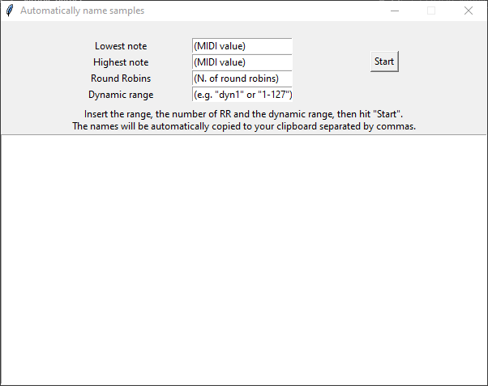
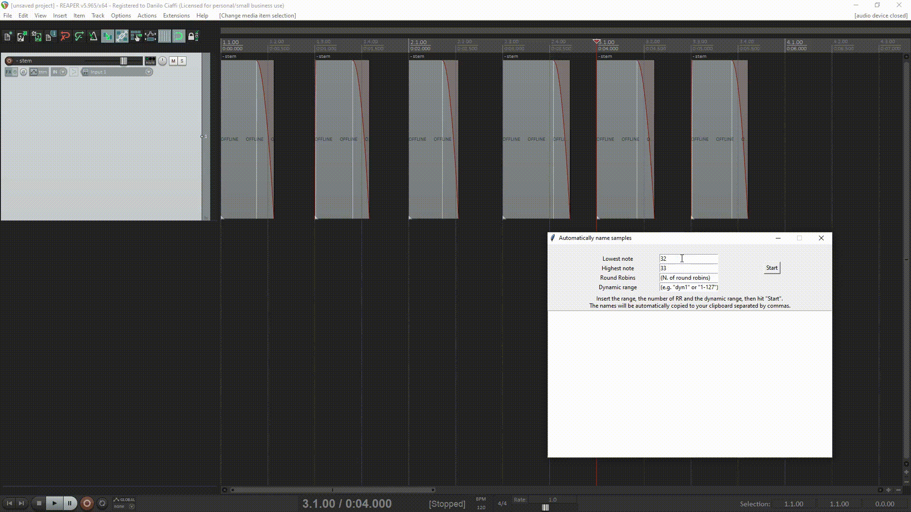

# Sample namer

This tool is thought for fast naming of samples, so that they are ready to be mapped in a sampler such as Kontakt or HISE.  
It takes in input the midi range, number of round robins and dynamic range label and copies to clipboard all the sample names separated by comma.

## Using with Reaper's scripts
In particular, the output is made so it can be used with Reaper's `X-Raym_Rename selected takes from CSV input.lua` script.

